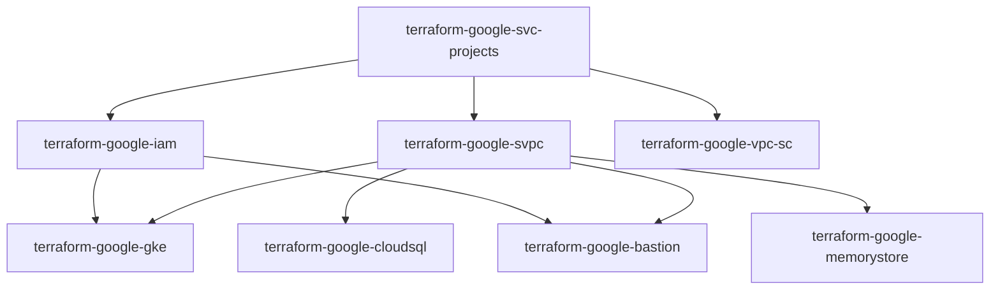

# GCP Terraform Modules

A comprehensive collection of enterprise-grade Terraform modules for Google Cloud Platform infrastructure provisioning. These modules provide secure, scalable, and production-ready infrastructure components following Google Cloud best practices.

## 🏗️ Architecture Overview

This repository contains modular Terraform configurations designed for a multi-project, multi-environment Google Cloud architecture. The modules work together to create a complete enterprise infrastructure including:

- **Multi-project structure** with host and service projects
- **Private GKE clusters** with enterprise security features
- **Shared VPC networking** with proper segmentation
- **Secure bastion hosts** for administrative access
- **Cloud SQL databases** with high availability and backup
- **Memorystore Redis** for caching and sessions
- **VPC Service Controls** for data exfiltration protection
- **IAM management** with least privilege access

## 📁 Module Overview

| Module | Description | Use Case |
|--------|-------------|----------|
| [`terraform-google-svc-projects`](./terraform-google-svc-projects/) | Creates and manages multi-project architecture | Foundation - Host and service projects |
| [`terraform-google-svpc`](./terraform-google-svpc/) | Shared VPC with subnets and firewall rules | Networking - Central network management |
| [`terraform-google-gke`](./terraform-google-gke/) | Enterprise GKE cluster with security hardening | Compute - Container orchestration |
| [`terraform-google-bastion`](./terraform-google-bastion/) | Secure jump host with audit logging | Security - Administrative access |
| [`terraform-google-cloudsql`](./terraform-google-cloudsql/) | Managed Cloud SQL with HA and backup | Storage - Relational databases |
| [`terraform-google-memorystore`](./terraform-google-memorystore/) | Redis cluster for caching and sessions | Storage - In-memory data store |
| [`terraform-google-iam`](./terraform-google-iam/) | IAM roles, policies, and service accounts | Security - Identity and access management |
| [`terraform-google-vpc-sc`](./terraform-google-vpc-sc/) | VPC Service Controls perimeter | Security - Data exfiltration protection |

## 🚀 Quick Start

### Prerequisites

1. **Google Cloud SDK** installed and configured

   ```bash
   gcloud auth application-default login
   gcloud config set project YOUR_PROJECT_ID
   ```

2. **Terraform** >= 1.5.0 installed

   ```bash
   terraform --version
   ```

3. **Required APIs** enabled in your Google Cloud project:

   ```bash
   gcloud services enable \
     cloudresourcemanager.googleapis.com \
     serviceusage.googleapis.com \
     compute.googleapis.com \
     container.googleapis.com \
     sqladmin.googleapis.com \
     redis.googleapis.com \
     servicenetworking.googleapis.com \
     dns.googleapis.com
   ```

4. **Required Permissions**:
   - `roles/resourcemanager.projectCreator` (if creating projects)
   - `roles/billing.projectManager` (for billing association)
   - `roles/compute.networkAdmin`
   - `roles/container.clusterAdmin`
   - `roles/cloudsql.admin`

### Basic Deployment

```hcl
# Generate unique suffix for resource naming
resource "random_string" "suffix" {
  length  = 4
  special = false
  upper   = false
}

# 1. Create multi-project structure
module "projects" {
  source = "./terraform-google-svc-projects"

  suffix             = random_string.suffix.result
  billing_account_id = "123456-ABCDEF-123456"
  folder_id          = "folders/1234567890"
  
  labels = {
    environment = "production"
    team        = "platform"
  }
}

# 2. Create shared VPC networking
module "network" {
  source = "./terraform-google-svpc"
  
  project_id = module.projects.host_project_id
  region     = "us-central1"
  
  depends_on = [module.projects]
}

# 3. Create GKE cluster
module "gke" {
  source = "./terraform-google-gke"
  
  project_id = module.projects.gke_project_id
  region     = "us-central1"
  network    = module.network.vpc_self_link
  subnetwork = module.network.subnets["gke"].self_link
  
  depends_on = [module.network]
}

# 4. Create bastion host
module "bastion" {
  source = "./terraform-google-bastion"
  
  project_id  = module.projects.host_project_id
  region      = "us-central1"
  vpc_name    = module.network.vpc_name
  subnet_name = module.network.subnets["bastion"].name
  
  authorized_networks = ["10.0.0.0/8"]
  
  depends_on = [module.network]
}

# 5. Create Cloud SQL database
module "database" {
  source = "./terraform-google-cloudsql"
  
  project_id      = module.projects.data_project_id
  instance_name   = "main-db"
  region          = "us-central1"
  database_version = "POSTGRES_15"
  
  ip_configuration = {
    private_network = module.network.vpc_self_link
    ipv4_enabled    = false
  }
  
  depends_on = [module.network]
}
```

## 📋 Module Dependencies

The modules are designed to work together in a specific order:



## 🔧 Individual Module Usage

### Multi-Project Setup

```hcl
module "projects" {
  source = "./terraform-google-svc-projects"
  
  suffix             = "prod"
  billing_account_id = var.billing_account_id
  folder_id          = var.folder_id
  
  # Creates: host-project-prod, gke-project-prod, data-project-prod
}
```

### Shared VPC Networking

```hcl
module "network" {
  source = "./terraform-google-svpc"
  
  project_id = module.projects.host_project_id
  region     = "us-central1"
  
  # Creates subnets for GKE, data services, bastion, and management
}
```

### Secure GKE Cluster

```hcl
module "gke" {
  source = "./terraform-google-gke"
  
  project_id = module.projects.gke_project_id
  network    = module.network.vpc_self_link
  subnetwork = module.network.subnets["gke"].self_link
  
  # Private cluster with Workload Identity and encryption
}
```

### Bastion Host

```hcl
module "bastion" {
  source = "./terraform-google-bastion"
  
  project_id = module.projects.host_project_id
  vpc_name   = module.network.vpc_name
  
  enable_iap_tunnel = true
  ssh_keys = {
    "admin" = file("~/.ssh/id_rsa.pub")
  }
}
```

## 🔒 Security Features

### Network Security

- **Private GKE clusters** with no public IPs
- **VPC Service Controls** for data exfiltration protection
- **Firewall rules** with least privilege access
- **Shared VPC** for centralized network management

### Identity & Access

- **Workload Identity** for secure pod authentication
- **IAP tunnels** for secure bastion access
- **Service accounts** with minimal required permissions
- **IAM best practices** enforcement

### Data Protection

- **Cloud SQL** with private IP and SSL enforcement
- **Encrypted persistent disks** and etcd encryption
- **Secrets management** with Secret Manager integration
- **Audit logging** for all administrative actions

### Compliance

- **Deletion protection** on critical resources
- **Binary Authorization** for container security
- **Shielded GKE nodes** with secure boot
- **Confidential GKE** for memory encryption

## 🌍 Multi-Region Deployment

```hcl
# Primary region deployment
module "primary_region" {
  source = "./complete-infrastructure"
  
  region = "us-central1"
  suffix = "primary"
  # ... other config
}

# Secondary region for disaster recovery
module "secondary_region" {
  source = "./complete-infrastructure"
  
  region = "us-west2"
  suffix = "secondary"
  # ... other config
}
```

## 📊 Monitoring & Observability

### Built-in Monitoring

- **GKE monitoring** with managed Prometheus
- **Cloud SQL** query insights and monitoring
- **Bastion host** access logging and audit trails
- **VPC Flow Logs** for network traffic analysis

### Recommended Additional Setup

```hcl
# Enable Cloud Monitoring and Logging APIs
resource "google_project_service" "monitoring" {
  for_each = toset([
    "monitoring.googleapis.com",
    "logging.googleapis.com",
    "cloudtrace.googleapis.com",
    "clouddebugger.googleapis.com"
  ])
  
  service = each.value
  project = var.project_id
}
```

## 💰 Cost Optimization

### Compute Optimization

- Use **preemptible nodes** for non-critical workloads
- Enable **cluster autoscaling** to match demand
- Configure **vertical pod autoscaling** for right-sizing

### Storage Optimization

- Use **pd-standard** disks for non-performance critical workloads
- Enable **disk autoresize** with limits
- Configure **backup retention** policies

### Networking

- Minimize **cross-region traffic** with regional deployments
- Use **private Google Access** to reduce NAT costs
- Configure **Cloud CDN** for static content

## 🔄 Deployment Patterns

### Environment Promotion

```bash
# Development
terraform workspace select dev
terraform plan -var-file="environments/dev.tfvars"

# Staging  
terraform workspace select staging
terraform plan -var-file="environments/staging.tfvars"

# Production
terraform workspace select prod
terraform plan -var-file="environments/prod.tfvars"
```

### GitOps Integration

```yaml
# .github/workflows/terraform.yml
name: 'Terraform'
on:
  push:
    branches: [main]
  pull_request:
    branches: [main]

jobs:
  terraform:
    name: 'Terraform'
    runs-on: ubuntu-latest
    
    steps:
    - uses: actions/checkout@v3
    - uses: hashicorp/setup-terraform@v2
      
    - name: Terraform Plan
      run: terraform plan -no-color
      
    - name: Terraform Apply
      if: github.ref == 'refs/heads/main'
      run: terraform apply -auto-approve
```

## 🛠️ Troubleshooting

### Common Issues

1. **API Not Enabled**

   ```bash
   # Enable required APIs
   gcloud services enable container.googleapis.com
   ```

2. **Insufficient Permissions**

   ```bash
   # Grant required IAM roles
   gcloud projects add-iam-policy-binding PROJECT_ID \
     --member="user:email@domain.com" \
     --role="roles/container.clusterAdmin"
   ```

3. **Quota Exceeded**

   ```bash
   # Check and request quota increases
   gcloud compute project-info describe --project=PROJECT_ID
   ```

4. **Network Connectivity**

   ```bash
   # Test bastion connectivity
   gcloud compute ssh bastion-instance --project=PROJECT_ID --zone=us-central1-a
   ```

### Debug Commands

```bash
# Check cluster status
gcloud container clusters describe CLUSTER_NAME --region=REGION

# View instance logs
gcloud compute instances get-serial-port-output INSTANCE_NAME

# Check Cloud SQL connectivity
gcloud sql connect INSTANCE_NAME --user=postgres --database=postgres
```

## 📚 Additional Resources

### Documentation

- [Google Cloud Architecture Center](https://cloud.google.com/architecture)
- [GKE Security Best Practices](https://cloud.google.com/kubernetes-engine/docs/security-best-practices)
- [Terraform Google Provider](https://registry.terraform.io/providers/hashicorp/google/latest/docs)

### Training

- [Google Cloud Professional Cloud Architect](https://cloud.google.com/certification/cloud-architect)
- [Terraform Associate Certification](https://www.hashicorp.com/certification/terraform-associate)

### Community

- [Google Cloud Slack Community](https://googlecloud-community.slack.com/)
- [Terraform Community](https://discuss.hashicorp.com/c/terraform-core/)

## 📄 License

This project is licensed under the GNU General Public License v3.0 - see the [LICENSE](LICENSE) file for details.

## 🤝 Contributing

1. Fork the repository
2. Create a feature branch (`git checkout -b feature/amazing-feature`)
3. Commit your changes (`git commit -m 'Add amazing feature'`)
4. Push to the branch (`git push origin feature/amazing-feature`)
5. Open a Pull Request

### Development Guidelines

- Follow [Terraform Style Guide](https://www.terraform.io/docs/language/style.html)
- Include comprehensive documentation
- Add examples for new modules
- Test changes in isolated environments
- Update README.md for any new features

## 📞 Support

For questions, issues, or contributions:

- **Issues**: [GitHub Issues](https://github.com/your-org/gcp-terraform-modules/issues)
- **Discussions**: [GitHub Discussions](https://github.com/your-org/gcp-terraform-modules/discussions)
- **Security**: Report security vulnerabilities privately

---

**Version**: 1.0.0  
**Terraform Version**: >= 1.5  
**Google Provider Version**: >= 5.0  
**Last Updated**: September 2025